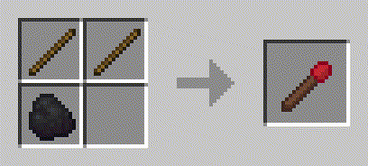
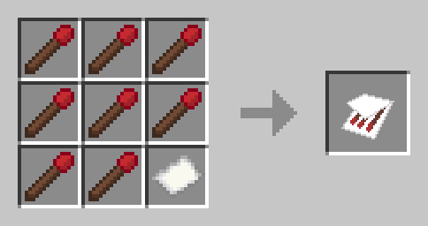

# Schmatches #

## Versions: 1.16.5 ##

Schmatches (or simple matches) is a fire starting mod for the Minecraft early game. Schmatches adds two new items to
the game:
* Match: Single use way to start fires. Does not stack.
* Matchbook: A more compact way to hold your matches, holds 8 matches and thus can be used 8 times before breaking.

The main purpose of this mod is for use in progression based mod packs, mainly those in which flint and steel requires 
actual steel rather than iron in order to be crafted.

### Recipes: ###
Both recipes are shapeless.
#### Matches: ####

#### Matchbook: ####

## You may freely use this mod in any mod pack you wish, so long as the mod pack download remains within CurseForge's ecosystem. ##
